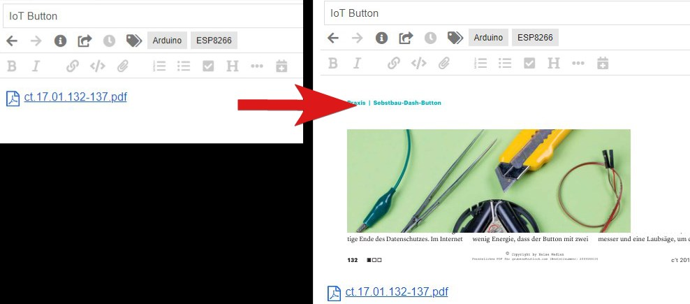
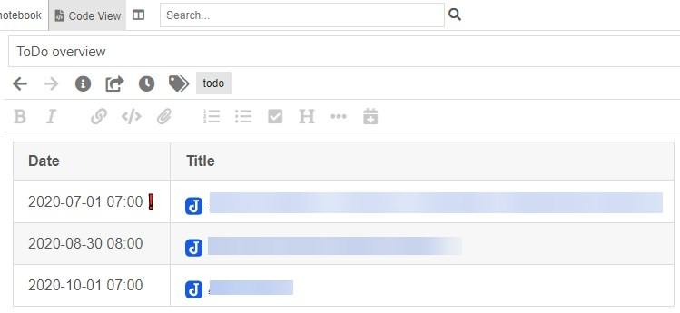

# Joplin python tools

Various python tools for Joplin.
For the communication with Joplin the API is used.

## Additional modules

Please einstall the following modules:

- [PyMuPDF](https://github.com/pymupdf/PyMuPDF)

```console
pip install PyMuPDF
```

## Tools

- [hotfolder.py](#hotfolderpy)
- [add_pdf_previews.py](#add_pdf_previewspy)
- [todo_overview.py](#todo_overviewpy)

### Parameters for all tools

- `-t` Joplin Authorisation token. Default: `Ask for token and store token`
- `-u` Joplin Web Clipper URL. Default `http://localhost:41184`

If no token is specified, the script will ask for it and then store it in the script's directory for later use when called without the `-t` option.

### hotfolder.py

---

Monitor a folder an add the Files to Joplin as a Note.

Images and text (Mimetype `text/plain`) are inserted directly into the note, other Files are added as attachment. The files are deleted after processing.

If you want to insert additional files directly as text, define them with the `--as-plain` switch.

**Example**

```python
python hotfolder.py -d "Import" -p "C:\JoplinImport"
```

**Parameters**

- `-d` Specify the notebook in which to place newly created notes. Default: `Import`
- `-p` Folder for monitoring
- `--as-plain` Specify file extensions comma separated for input as text. Example: `.md, .json`
- `--tag` Specify of comma separated Tags which should be added to the note. Example: `scan, todo`
- `--preview` Create a preview of the first site from an PDF file.

### add_pdf_previews.py

---

Search for notes with a PDF attachment an create a preview of the first PDF Site and add this Preview to Note.



**Parameters**

- `-n` Defines the notebook in which notes with PDF file should be searched. Default: `All notebooks`

**Example**

```python
python add_pdf_previews.py -n "Import"
```

### todo_overview.py

---

Creates or Updates a note with a list of all open ToDo's. All to-dos that have been exceeded are marked with a ❗.



**Parameters**

- `-n` Defines the notebook in which the new Note should be created.
- `--title` Defines the title for the note to be updated or createt. Default `ToDo overview`
- `--as-todo` Create the note as a ToDo
- `--tag` Specify of comma separated Tags which should be added to the note. Example: `scan, todo`

**Example**

```python
python todo_overview.py --title "Open ToDo's" --as-todo --tag "importend"
```
